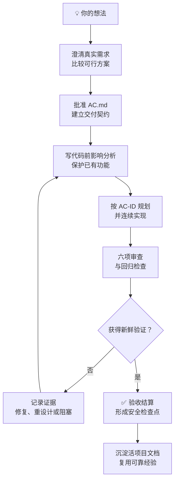
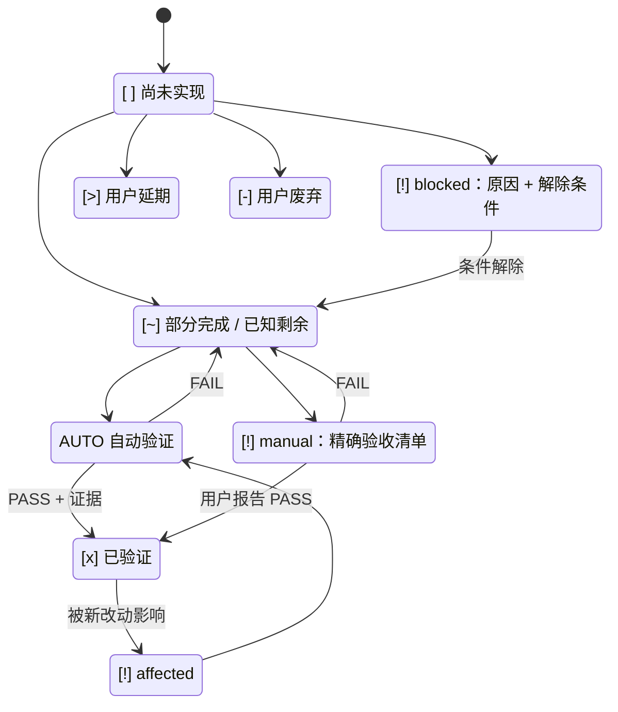
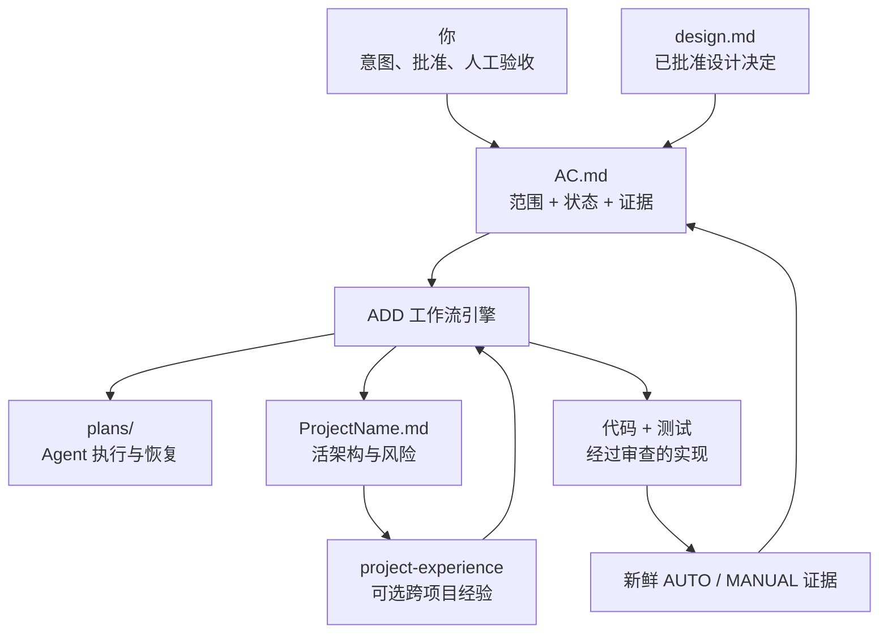

# 验收驱动开发（ADD）v2.6.0

<p align="center">
  <strong>🚀 真正的项目级 AI 开发工作流</strong><br>
  从“我有一个想法”，走到“这个功能已经被证明可用”。<br>
  让不懂编程的小白也能推动 Agent 开发真正可用的项目，让专业开发者获得可审查、可恢复的工程闭环。
</p>

<p align="center">
  <strong>验收契约 · 影响分析 · 实施规划 · 代码审查 · 新鲜证据 · 安全检查点</strong>
</p>

<p align="center">
  <a href="./README.md">English</a> ·
  <a href="#一条请求看懂-add">60 秒体验</a> ·
  <a href="#安装-add">安装</a> ·
  <a href="#cc-switch-显示识别到-0-个技能">CC Switch 帮助</a>
</p>

---

## 你的 Agent 说“完成了”。你并不相信。

AI 写代码已经很快了。真正困难的是：得到一个**完整、可用、能够被验证的项目**，而不是一个看起来很厉害、点到第二个按钮就露出问题的演示品。

你提出功能，Agent 写完代码，编译可能也通过了，然后自信地说：**“完成了。”**但随后你发现：需求被理解错了、某条 GUI 路径从未真正测试、一个修复破坏了旧功能，或者大量待办只存在于计划文档里，验收文档却无人维护。

> [!IMPORTANT]
> **ADD 是真正的项目级解决方案，不是又一段提示词。**它为 Agent 提供持久的验收契约、受控的实现闭环、证据规则、恢复状态，以及不可含糊的完成定义。

ADD 不会把模型变得永不犯错。它做的是让遗漏、猜测、回归、验证受阻和未完成工作在被误认为“交付”之前，全部变得**清晰可见**。

### 为想要结果，而不是只想看 Agent 表演的人设计

| 你是…… | ADD 能给你…… |
|---|---|
| 有产品想法、但不懂编程的小白 | 从问题澄清和方案选择，到可审阅 AC 与明确测试步骤的一条完整路径。 |
| 每天使用编码 Agent 的开发者 | 影响分析、AC 映射计划、审查关卡、新鲜验证和范围严格的本地 Git 检查点。 |
| 正在维护越来越复杂的项目 | 一份长期可信的范围、状态、证据、延期和受影响行为事实源。 |
| 同时开发多个项目 | 活项目文档与可选的证据化经验复用，不再让每个项目都从零开始。 |

**你不需要理解每一处实现细节。**你只参与真正需要人类判断的部分：澄清意图、批准设计和验收标准、完成 Agent 无法代替的人工验收。剩下的工程执行由 ADD 为 Agent 组织。

---

## ADD 如何闭环



整个引擎只服从一条核心规则：

> **代码只是产物，证据代表进展，全部验收项得到明确结算才叫完成。**

只要 `AC.md` 仍显示未实现、部分完成、受到影响、验证受阻或等待你的测试，Agent 就不能诚实地把功能称为“完成”。

---

## 使用 ADD 前后

| 没有 ADD | 使用 ADD |
|---|---|
| “能编译，所以完成。” | “AC-12 已运行验证命令，这是实际结果。” |
| Agent 静默补全没有说清的需求。 | 先讨论真正影响设计的问题，行为变化批准后才写代码。 |
| writing-plans 等计划文档变成唯一待办清单。 | `AC.md` 始终是用户唯一验收状态来源。 |
| 小修复悄悄破坏其他功能。 | 影响分析标记受影响 AC，并强制重新验证。 |
| GUI 功能没人真正点过就宣布完成。 | 保持 `[!] [manual]`，并向你提供精确测试步骤。 |
| Agent 每做一步都停下来询问是否继续。 | Mode A 在真正关卡、阻塞或人工交接前持续执行。 |
| 同一个失败被一遍遍打补丁。 | 三次完整失败周期后阻塞受影响路径，暴露指导或重设计需求。 |
| 每次会话、每个项目都从零开始。 | 持久计划、项目记录和证据化经验可以跨上下文恢复。 |

---

## 不只是验收清单，而是一台完整的开发引擎

| 核心能力 | 它在真实项目中改变什么 |
|---|---|
| 🧭 **步进式设计探索** | 新项目或真正含糊的变更中，ADD 每次只问一个关键问题，比较有意义的方案，再把批准设计转换为 AC。 |
| 🧾 **验收状态权威** | `AC.md` 管理范围、状态、证据、人工确认、延期与废弃；计划永远不拥有验收状态。 |
| 🔎 **代码前影响分析** | 修改开始前找出可能回归的已有行为，并要求新鲜复验。 |
| 🛠️ **真正帮助 Agent 实现** | 较大任务使用 AC 映射的持久计划，小型确定变更使用轻量六字段 Execution Map。 |
| 🧪 **证据化验证** | AUTO 项必须运行命令并记录结果；MANUAL 项必须给出精确步骤，而不是一句“请测试”。 |
| 🔁 **失败与恢复纪律** | 尝试、阻塞、取消、重设计和跨会话恢复都会留下记录，不随聊天上下文消失。 |
| 🔒 **安全本地检查点** | 只提交 Agent 自己的目标修改，绝不擅自 push、PR、merge、tag 或发行。 |
| 🧠 **项目经验闭环** | 活文档保留架构与风险；可选 `project-experience` 会把已证实经验带入未来项目。 |

### 一眼看懂：功能现在到底是什么状态



仅仅写完代码、计划任务显示 `verified`，或已经产生 commit，都不能凭空得到绿色的 `[x]`。

### 一份验收契约，串起完整的项目资产



边界非常明确：设计文档解释批准的选择，计划帮助 Agent 执行，项目文档保留长期工程事实；**只有 `AC.md` 告诉用户哪些功能已经验收。**

---

## 一套工作流，适配不同编码 Agent

ADD 使用可移植的 `SKILL.md` 结构，并把项目事实保存在普通 Markdown 文件中。当前仓库为主流 Agent 宿主提供了直接安装路径：

| Claude Code | Codex | OpenCode | Gemini CLI | 其他 `SKILL.md` 宿主 |
|:---:|:---:|:---:|:---:|:---:|
| 支持 | 支持 | 支持 | 支持 | 取决于宿主实现 |

ADD 的核心闭环完全自包含。外部计划工具、审查子 Agent、Obsidian 和 `project-experience` 都是可选增强；即使缺少其中任何一项，验收闭环仍然可以运行。

---

## 一条请求看懂 ADD

安装后新开 Agent 会话，然后说：

```text
使用 ADD 构建一个照片浏览器。
```

继续已有项目：

```text
使用 ADD 继续开发 ImageView。
```

修改已经可用的软件：

```text
给图片浏览器增加批量删除功能，使用 ADD。
```

你应看到当前阶段、相关 AC、影响分析、审查结果，以及新鲜命令证据或明确的用户测试清单。新项目中，ADD 会先步进式探索设计，再逐条提出拟议 AC，避免一次扔给你几十条难以修改的验收项。

---

## 项目变大后，你得到什么

### 一张始终诚实的 AC 表

`AC.md` 是验收状态的单一事实来源：

| 标记 | 含义 |
|---|---|
| `[ ]` | 尚未实现 |
| `[~]` | 已批准工作仍有已知剩余 |
| `[x]` | 本轮新鲜验证通过 |
| `[!] [manual]` | 等待一组明确的人工验收步骤 |
| `[!] [affected]` | 原本通过，但受其他改动影响 |
| `[!] [blocked]` | 当前无法验证，已记录原因和解除条件 |
| `[>]` | 用户明确延期 |
| `[-]` | 用户明确废弃 |

### 一份不会随会话消失的项目记录

```text
$DOC_HUB/<ProjectName>/
├── AC.md                  # 唯一验收事实来源
├── design.md              # 必要时保存已批准设计
├── plans/                 # 永久保留的 Mode A 实施记录
└── <ProjectName>.md       # 活架构、风险、模式和证据
```

ADD 负责项目文档的创建和更新；`project-experience` 读取这些文档，再把跨项目、已证实的经验提炼成紧凑缓存。

### 强大时足够强大，简单时保持安静

你不需要先背 Phase 名称才能使用 ADD：

- **Phase 3.5A** 安全进入已经批准的积压工作；
- **Phase 3.5B** 在写代码前处理新功能、bug、重构或行为变化；
- **Mode A** 为已批准积压和较大批次使用 AC 映射的持久计划；
- **Mode B** 为一至两个已确定 AC 使用聊天内六字段 Execution Map；
- 两种模式都必须经过影响分析、审查、验证和 AC 状态更新。

用户审核设计与验收标准，不需要审核 Agent 的内部任务计划。Agent 侧检查通过后，ADD 默认创建范围严格的本地 Git 检查点；它会保留既有修改，无法安全隔离时报告 `COMMIT-BLOCKED`，遵守明确的“不提交”指令，并且绝不会自行 push、创建或合并 PR、打 tag 或发布。

---

## 安装 ADD

请安装 ADD；如需基于证据的跨项目经验，再安装推荐的配套 Skill：

```text
acceptance-driven-development
project-experience
```

ADD 负责验收工作流，并内置 Greenfield 或真正含糊变更所需的条件式设计探索；`project-experience` 在宿主支持时提供跨项目经验。

### 方案一：CC Switch

1. 选择目标 Agent 应用；
2. 进入 **技能 → 发现技能 → 仓库管理 → 添加技能仓库**；
3. 填写：

   ```text
   仓库 URL：https://github.com/ZeusYue/acceptance-driven-development-skill
   分支：main
   ```

4. 回到**发现技能**；必要时刷新；
5. 安装 `acceptance-driven-development`；
6. 可选安装推荐配套的 `project-experience`；
7. 在目标 Agent 中新开会话。

仓库已使用 CC Switch 递归扫描的结构：

```text
skills/
├── acceptance-driven-development/SKILL.md
└── project-experience/SKILL.md
```

详细说明见 [CC Switch 安装指南](./docs/CCSWITCH-zh.md)。

### CC Switch 显示“识别到 0 个技能”

URL 和分支都正确后，0 个技能仍可能只是一次临时的 **GitHub 分支压缩包下载或发现刷新失败**，不一定是仓库布局错误。

请依次检查：

1. 仓库 URL 是根地址，不是文件 URL 或 `tree/...` URL；
2. 分支严格是 `main`；
3. 回到“发现技能”刷新扫描；
4. 重启 CC Switch 后再次刷新；
5. 已保存的记录无法修正时，删除后用 `main` 重新添加。

#### 网络与代理

CC Switch 发现仓库时需要下载 GitHub 的分支压缩包。如果 GitHub 网络访问受限或不稳定，界面可能只显示 0 个技能，而没有展示下载失败的细节。

- 用浏览器打开以下地址，确认分支压缩包可下载：

  ```text
  https://github.com/ZeusYue/acceptance-driven-development-skill/archive/refs/heads/main.zip
  ```

- 无法下载时，请切换网络，或按你的环境配置系统 / CC Switch 的网络代理；
- 网络或代理改变后，重启 CC Switch，再刷新“发现技能”；
- 若压缩包可下载但仍显示 0 个技能，可先手动安装，并在 Issue 中提供 CC Switch 版本和截图。

### Windows：报错“创建符号链接失败：……”

这通常是本地 Skill 安装的权限或存储位置问题，不是仓库 URL、分支或仓库结构问题。

1. **符号链接可正常创建时应优先使用**：它保持一个共享 Skill 来源，不会让目标 Agent 显示重复 Skill。
2. 打开 CC Switch **设置**，分别检查“同步/安装方式”和 **Skills 存储位置**。`~/.agents/skills` 适合作为共享存储位置，但只修改存储位置不会授予符号链接权限；修改任一设置后都应重启并重新安装。
3. 若要继续使用符号链接，请以**管理员身份**启动 CC Switch，或启用 Windows 开发人员模式后重试。
4. **Copy / 复制仅作为临时兜底**。需要明确把同步方式改为 Copy，并先移除或重新安装旧的目标 Agent 副本，避免同一 Skill 出现多个物理副本。

完整恢复顺序见 [CC Switch 安装指南](./docs/CCSWITCH-zh.md)。

### 方案二：手动安装

将完整的 `skills/acceptance-driven-development/` 目录复制到 Agent 官方文档指定的 Skill 目录，必须保留其中的 `assets/` 与 `references/`；需要跨项目经验时，再复制完整的 `skills/project-experience/`：

| Agent 宿主 | 常见 Skill 目录 |
|---|---|
| Claude Code | `~/.claude/skills/` |
| Codex | `~/.codex/skills/` |
| Gemini CLI | `~/.gemini/skills/` |
| OpenCode | `~/.config/opencode/skills/` |
| Hermes | `~/.hermes/skills/` |

---

## 首次运行：选择文档中枢

首次收到代码相关请求时，ADD 会询问一个稳定的共享目录。推荐回答：

```text
~/project-docs/
```

ADD 会写入 `~/.add-hub`，并将 AC、项目文档、模板和可选经验缓存保存在其中。Obsidian 有帮助，但不是必需条件。

---

<details>
<summary><strong>📦 版本历史与技术契约详情</strong></summary>

以下内容为维护者和已有用户保留各版本的具体行为与迁移说明。新用户阅读上方的能力介绍与安装指南即可开始使用。

## v2.6.0：可检查、可恢复的实施执行层

v2.6.0 补齐了从已批准 AC 到已验证代码之间的执行闭环：

- Mode A 创建或安全恢复唯一持久计划，已完成计划不会被覆盖或重新打开；
- Mode B 使用聊天内六字段 Execution Map，同时保留状态、尝试次数、仓库基线、证据、审查和提交结果；
- Mode B 每个目标 AC 都在证据中保留独立、防冲突的尝试 series；聊天上下文丢失后，从该证据和方案引用恢复，无法可靠重建时返回 Phase 3.5B，而不是猜测；
- 每个任务按实际情况选择 `TEST-FIRST`、`CHARACTERIZATION`、`TEST-AFTER` 或 `MANUAL`，不强迫所有项目套用同一种测试方法；
- 只有写入范围不重叠的独立任务才可并行；取消或批准后拒绝都必须收拢委派任务，Mode A 以不同原因暂停，Mode B 持久化恢复状态，并且不消耗失败次数；
- 必需环境或工具不可用时立即形成有证据的阻塞，不让任务悬挂在活动状态，也不虚构失败周期；独立工作继续；
- Mode A 实质重设计转 Mode B 时，必须先结算 delegates 和旧任务所有权；Mode B 结算后，旧计划要么完成，要么恢复剩余工作；
- 连续三个“实现→验证→审查”周期失败只阻塞受影响工作，除非共享前置条件使整批无法继续；
- 安全本地提交会复查 index、Git 操作状态、hooks、暂存内容、最终 commit 与工作树，但不会接触远端；
- 稳定的 EVD 和范围决策记录把验证历史留在 AC 表之外，也覆盖用户报告的 MANUAL 结果。

`AC.md` 仍是唯一验收状态权威。计划任务 verified 或本地 commit 都不能自行把 AC 标记为完成。
检查点结果只能是 commit hash、`COMMIT-BLOCKED` 或 `COMMIT-SKIPPED`；hook 导致提交后出现异常修改时，以 `COMMIT-REVIEW-REQUIRED` 停止后续提交。

---

## v2.5.0：ADD 内置设计探索

v2.5.0 移除了 ADD 残留的 Superpowers 耦合：

- ADD 现在仅在显式 ADD 方案探索、Greenfield Gate 1，以及大型或真正含糊的 Phase 3.5B 变更中加载自己的设计探索 reference；
- 它只询问真正影响设计的问题，比较有意义的方案，取得一次设计批准，并在 ADD 内记录 **Design Decision Handoff**；
- 大型 Phase 3.5B 会把设计与拟议 AC 变更一起提交一次合并批准；
- 设计 reference 不会强制使用 `docs/superpowers` 或跳转到其他开发方法；批准后的范围会交回 ADD 自己的规划与执行层；
- 外部规划工具是可选增强；ADD 内置 Mode A 计划仍为必需，每项任务必须映射 AC-ID，且计划状态永远不拥有验收状态；
- 已批准的行为变更会在写代码前使被修改目标的旧 `[x]` 失效；用户恢复延后的 `[>]` 条目时，原范围与变更范围都有明确路径回到可执行状态；
- 已批准积压、已确定的中小型变更、恢复原行为的 bug、等价重构、构建/配置变更和纯样式修改都会跳过设计 reference；
- 不再安装独立的 ADD brainstorming Skill，因此可以与 Superpowers 的通用 `brainstorming` 共存而没有重名或触发歧义。

即使没有规划工具、审查子 Agent 或 `project-experience`，ADD 仍能独立完成闭环。

---

## v2.4.2：AC 表格可读性与证据详情

v2.4.2 在不削弱 `AC.md` 权威的前提下，让验收表更容易扫描：

- Obsidian 用户可通过可选的 `ac-document-tables.css` 资产，让所有五列 AC 表使用稳定的全宽列比例；
- `ID` 与`状态`保持紧凑，标准、验证方式和预期结果正常换行；
- 完整日志、基准样本、截图说明和逐步用户反馈写入同一份 `AC.md` 的“验证证据详情”；
- 英文、中文、Skill 安装资产与手动下载模板采用相同 schema 和证据结构；
- 发行校验现在会保护样式类、证据详情区、CSS 资产与长证据边界。

现有 AC 文档继续有效。Obsidian 文档如需启用布局，只需增加 `cssclasses: ac-document`，将 `ac-document-tables.css` 复制到 `.obsidian/snippets/` 并启用；其他 Markdown 宿主会直接忽略这个可选样式类。

---

## v2.4.1：Mode A 连续执行热修复

进度公告不是暂停关卡。只要已批准的 Mode A 批次仍有可执行的 `[ ]` 或 `[~]`，ADD 默认顺序继续，仅允许写入范围不重叠的任务并行；Task 边界或子 Agent 调度不能成为“要不要继续”的提问理由。只有显式 ADD 关卡或真实宿主/工具限制才能暂停该批次。

---

## v2.4：AC 权威恢复

v2.4 恢复 `AC.md` 作为开发引擎不可让渡的权威：

- 可安装的模板资产会为缺失的文档中枢播种模板，不再让 Agent 临时自由发挥 AC 布局；
- **AC Contract Gate** 要求在写计划或代码前验证 AC 结构；
- 实施计划只能从已批准 AC 派生，必须包含 Acceptance Mapping，且**计划永远不拥有验收状态**；
- 每条人工验收项都会得到带精确步骤和 AC-ID 回复格式的 Manual Verification Handoff。

既有的本地化 AC 文档继续兼容；ADD 会保留其编号、证据和语言，含义不明确的迁移必须征求用户确认。

---

## v2.3.1 安装文档热修复

v2.3.1 不改变 ADD 工作流，只修正 Windows 下 CC Switch 的恢复路径：

- 符号链接可用时优先使用，目标 Agent 只会看到一个共享 Skill 来源；
- `~/.agents/skills` 用于解决共享存储或布局问题；管理员启动或 Windows 开发人员模式才用于授予符号链接权限；
- 若仍无法使用链接，应明确选择 Copy / 复制且只作为临时兜底，因为多个物理副本可能造成重复 Skill 条目。

---

## 迁移到 v2.3

现有 AC 表和安装方式保持兼容。v2.3 在不移除工作流保障的前提下，降低了 Agent 加载 ADD 的上下文负担：

- `SKILL.md` 变为更短的操作核心：入口关卡、Phase 3.5、实现模式、审查、新鲜验证、完成条件、活项目文档与缓存原子刷新仍保留在主文件；
- 完整示例、反合理化护栏、扩展红旗和详细的变更设计说明迁入 `references/`，仍是技能的一部分；
- 发行验证会检查核心契约、全部必需 reference 文件，以及 380 行的主文件上限。

不要通过删除 `_exp_memory.md` 刷新缓存；准备好时要求安全更新经验缓存。

</details>

---

## 支持与贡献

- 通过 [GitHub Issues](https://github.com/ZeusYue/acceptance-driven-development-skill/issues) 报告流程、文档或安装问题；
- 修改工作流前先读 [维护者改进指南](./docs/IMPROVEMENT-GUIDE.md)；
- 修改工作流契约时，请同步更新 Skill、template/reference、README 与 `tests/validate-release.ps1`。

使用 [MIT License](./LICENSE) 发布。Copyright © 2026 ZeusYue。
