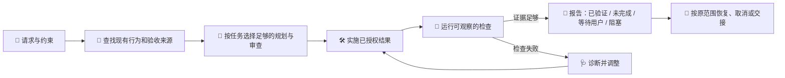

# 验收驱动开发（ADD）v3.0.0

[English](README.md) · [安装](#安装) · [参与改进](docs/IMPROVEMENT-GUIDE.md)

> 给 AI 编程 Agent 一个可以证明的终点，而不是一串看似完整的步骤。🧭

ADD 是一项面向 Agent 的技能：把软件请求转成可观察的结果，带着工作走到这个结果，并严格按现有证据报告实际情况。宿主将它用于创建或修改持久软件项目时，ADD 会自动参与；你也可以直接说 **“使用 ADD”** 来显式启动这套循环。

## 从“看起来完成”到“拿得出证据”

| 使用 ADD 之前 | 使用 ADD 之后 |
|---|---|
| “导出上限修好了。” | “导出接受 20 条；在所述环境中，边界检查已通过。” |
| 把计划完成或构建变绿当作验收。 | 分开报告进度、验收状态和证据。 |
| 每个任务都套同一套仪式。 | 小修复保持轻量；高风险或不确定工作才增加规划和审查。 |
| 找不到文档就悄悄新建 `AC.md`。 | 先复用权威记录；没有来源时先询问路径，再决定是否建立持久记录。 |
| 失败命令消耗固定重试次数。 | Agent 诊断原因、调整实验，只要还有有价值的下一步就继续。 |

这样，意图、代码、检查和交接会彼此对得上：小事不被流程淹没，复杂工作留下别人可以接手的上下文。

## 快速示例

你可以这样说：

```text
使用 ADD 增加 CSV 导出：用户最多导出 20 行，下载保持现有列顺序，
现有导出继续可用。请告诉我你验证了什么。
```

ADD 会帮助 Agent 把请求转成具体检查，了解现有导出路径，完成已授权的修改，验证 20 行边界和回归场景，然后说明哪些结果有证据支持、哪些仍需人工或其他环境验证。常规实现选择无需再次批准；影响产品结果的重要取舍仍由你决定。

## 工作循环



循环会根据不确定性、依赖、可逆性和影响调整深度。还有独立工作可做时继续推进；确实缺少前置条件时记录原因；受影响的路径需要当前环境之外的信息、能力、资源或授权时，明确停下并交接。

## ADD 始终把这些事情说清楚

- **结果与范围。** 请求定义目标、约束和相关回归；无关积压不会静默加入。
- **验收与证据。** 每项检查都说明观察到的状态和环境。构建成功只能证明构建成功，不能替代所有行为验收。
- **恢复与取消。** 检查失败后尽量诊断和修复；已取消或延期的范围会保留，直到你改变决定。
- **如实状态。** 已验证、未完成、等待人工验收、阻塞是不同结果；计划完成或提交代码本身不是验收证据。
- **可恢复上下文。** 可能跨会话的工作可以维护一份映射到结果的简洁计划和交接记录。

## 验收记录：先发现，再决定是否创建

需要持久标准时，ADD 会从项目指令、工作区、交接记录、issue、规格说明，以及你提供的路径或 URL 中寻找权威来源。

1. **找到就复用。** 保留稳定的验收项 ID、范围决定、取消记录和仍有效的证据。
2. **没有来源或已声明位置时，先询问路径、URL 或 issue/验收项 ID。** 等待期间仍可继续独立工作，也可以在对话中整理草案。
3. **禁止静默创建默认 `AC.md`。** ADD 不要求文档中枢、共享缓存、配套技能或个人主目录配置。

包内提供两个可选起点：[ac-template.md](skills/acceptance-driven-development/assets/ac-template.md) 和 [work-record-template.md](skills/acceptance-driven-development/assets/work-record-template.md)，它们是模板，不是强制流程。

## 安装

将**完整的** [skills/acceptance-driven-development/](skills/acceptance-driven-development) 目录复制到宿主配置的技能位置，并保留其中的 `SKILL.md`、`references/` 和 `assets/`。

```text
<宿主配置的技能目录>/
└── acceptance-driven-development/
    ├── SKILL.md
    ├── references/
    └── assets/
```

如果安装器支持选择仓库子目录，请从[本仓库](https://github.com/ZeusYue/acceptance-driven-development-skill)选择 `skills/acceptance-driven-development`。使用 ZIP 时先解压再复制；更新时整体替换已安装目录，避免退役引用残留。需要保留的本地定制请另行保存。

具体位置、重新加载步骤和运行时权限，以宿主当前文档为准。[CC Switch 安装说明](docs/CCSWITCH-zh.md)是可选参考。本包使用 Markdown，不声称已测试所有宿主或安装器版本。

安装后按宿主要求新开或重新加载会话，用“使用 ADD”提出一个小型项目请求，确认 Agent 读取技能并执行与任务匹配的验证。

## 从 2.x 迁移

3.0.0 用一套围绕结果的执行循环替代编号阶段、Mode A/B 选择、固定失败次数和强制文档初始化。规划深度由任务的不确定性、依赖和影响决定；提交等交付操作遵循你的请求与仓库惯例。

已有验收记录继续保留：稳定 ID、范围、有效结果以及取消或延期决定都应维持。代码、依赖、环境或前提变化影响证据时，再重新判断其有效性。旧尝试计数和计划所有权协议不再控制执行，无需批量迁移项目文档。

原 `project-experience` 配套技能不再包含在本包中。更新 ADD 不会删除单独安装的配套技能或现有项目资料；是否继续使用请另行决定。

## 验证边界

在仓库根目录使用 Python 3.10+ 运行：

```sh
python tests/validate_release.py
python -m unittest discover -s tests -p "test_*.py"
```

这些命令检查包完整性和验证器行为，无法证明 Agent 已完成所有 UI、生产环境或用户偏好相关结果。行为评估需要在目标宿主和环境中执行代表性任务。[验证报告](docs/validation-report.md)记录了本地定性探测、隔离样例检查及其局限。

## 参与贡献

先阅读[改进指南](docs/IMPROVEMENT-GUIDE.md)，再提交聚焦的 issue 或拉取请求。报告可复现问题时，请通过 [GitHub Issues](https://github.com/ZeusYue/acceptance-driven-development-skill/issues) 提供任务、宿主与模型、实际行为、预期结果和已有证据，并移除私人信息。

本项目采用 [MIT License](LICENSE) 发布。Copyright © 2026 ZeusYue。
