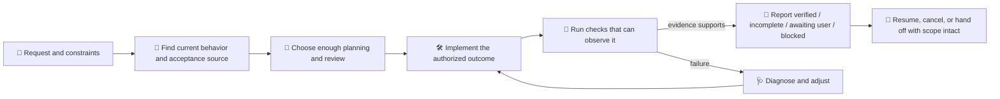

# Acceptance-Driven Development (ADD) v3.0.1

[简体中文](README-zh.md) · [Install](#install) · [Contribute](docs/IMPROVEMENT-GUIDE.md)

> Give an AI coding agent a destination it can prove, not a pile of hopeful steps. 🧭

ADD is a skill for agents that turns a software request into an observable outcome, guides the work to that outcome, and reports exactly what the available evidence supports. It joins the work automatically when a host uses it for creating or changing a persistent software project. You can also say **“Use ADD”** when you want the loop explicitly.

## From “looks done” to “can show done”

| Before ADD | After ADD |
|---|---|
| “The export limit is fixed.” | “Exports accept 20 items; the boundary check passes in the stated environment.” |
| A plan or green build is treated as completion. | Progress, acceptance, and evidence are reported separately. |
| Every task follows the same ceremony. | A tiny repair stays light; risky, uncertain work gets deeper planning and review. |
| A missing document quietly becomes a new `AC.md`. | Existing authoritative records are reused; missing sources trigger a question before a durable record is created. |
| A failed command burns through a preset retry count. | The agent diagnoses, changes the experiment, and continues while a useful next step exists. |

The result is a tighter conversation between intent, code, checks, and handoff. Small work remains small. Complex work leaves a trail another person can resume.

## A quick example

Ask:

```text
Use ADD to add CSV export. Users can export at most 20 rows,
the download must keep the current column order, and existing exports
must continue to work. Tell me what you verified.
```

ADD helps the agent turn that request into concrete checks, inspect the existing export path, implement the authorized change, exercise the 20-row boundary and a regression case, then report what passed and what still needs a human or a different environment. There is no second approval for routine implementation choices; material product decisions remain yours.

## The loop



The loop adapts to uncertainty, dependencies, reversibility, and impact. It keeps working when an independent task is still useful, records a real missing prerequisite, and stops the affected path when progress needs information, capability, resources, or authorization that is not available.

## What ADD keeps visible

- **Outcome and scope.** The request defines the target, constraints, and relevant regressions. Unrelated backlog does not silently enter the job.
- **Acceptance and evidence.** A check names the state and environment it observed. A successful build proves a build; it does not prove every requested behavior.
- **Recovery and cancellation.** Failed checks lead to diagnosis and repair when possible. Cancelled or deferred scope stays recorded until you change that decision.
- **Honest status.** Verified, incomplete, awaiting human validation, and blocked are different results. A finished plan or commit is not acceptance evidence by itself.
- **Resumable context.** Multi-step work can keep a concise plan and handoff that map back to outcomes.

## Acceptance records: discover first, create deliberately

When durable criteria are useful, ADD looks for an authoritative source through the project instructions, workspace, handoff, issue, specification, or a path/URL you provide.

1. **Find it, then reuse it.** Preserve stable criterion IDs, scope decisions, cancellations, and still-valid evidence.
2. **If no source or declared location exists, ask for a path, URL, or issue/criterion ID first.** Independent work and a conversational draft can continue while that decision is pending.
3. **Never silently create a default `AC.md`.** There is no required hub, shared cache, companion skill, or personal home-directory setup.

The package includes optional starting points: [ac-template.md](skills/acceptance-driven-development/assets/ac-template.md) and [work-record-template.md](skills/acceptance-driven-development/assets/work-record-template.md). They are templates, not a mandate.

## Install

Copy the **entire** [skills/acceptance-driven-development/](skills/acceptance-driven-development) directory into the skills location configured by your agent host. Keep `SKILL.md`, `references/`, and `assets/` together.

```text
<your host's configured skills directory>/
└── acceptance-driven-development/
    ├── SKILL.md
    ├── references/
    └── assets/
```

If your installer accepts repository subdirectories, choose `skills/acceptance-driven-development` from [this repository](https://github.com/ZeusYue/acceptance-driven-development-skill). For a ZIP, extract before copying. To update, replace the installed skill directory as one unit so retired references do not remain active. Keep local customizations separately.

Use your host's current documentation for the exact location, reload step, and runtime permissions. [CC Switch installation notes](docs/CCSWITCH.md) are optional. This package is Markdown; it does not claim every host or installer version has been tested.

After installation, start or reload a session as your host requires and try a small project request with “Use ADD.” Confirm that the agent reads the skill and performs fitting verification.

## Migrating from 2.x

Version 3 replaces numbered phases, Mode A/B selection, fixed failure-attempt quotas, and mandatory document setup with one outcome-driven loop. Version 3.0.1 clarifies that the optional acceptance template is language-neutral. Planning depth follows the work's uncertainty, dependencies, and impact. Delivery operations such as commits follow your request and repository practice.

Keep existing acceptance records: preserve stable IDs, scope, valid results, and cancellation or deferral decisions. Reassess evidence when code, dependencies, environment, or assumptions change. Old attempt counters and plan-ownership protocols no longer control execution; no bulk document migration is required.

The former `project-experience` companion is not part of this package. Updating ADD does not remove a separately installed companion or your project documents; decide separately whether those resources still fit your workflow.

## Validation limits

From the repository root, with Python 3.10+:

```sh
python tests/validate_release.py
python -m unittest discover -s tests -p "test_*.py"
```

These commands check package integrity and validator behavior. They do not establish that an agent completed every kind of UI, production, or user-preference outcome. Behavioral evaluation requires representative tasks in the target host and environment. The [validation report](docs/validation-report.md) records local qualitative probes and isolated fixture checks, together with their limits.

## Contribute

Read the [improvement guide](docs/IMPROVEMENT-GUIDE.md), then open a focused issue or pull request. For a reproducible problem, use [GitHub Issues](https://github.com/ZeusYue/acceptance-driven-development-skill/issues) and include the task, host/model, observed behavior, expected outcome, and the evidence you collected—with private information removed.

Released under the [MIT License](LICENSE). Copyright © 2026 ZeusYue.
