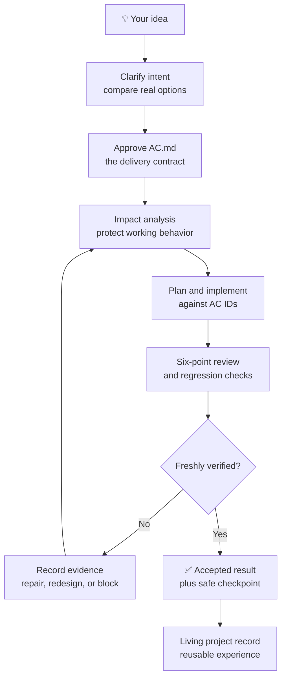
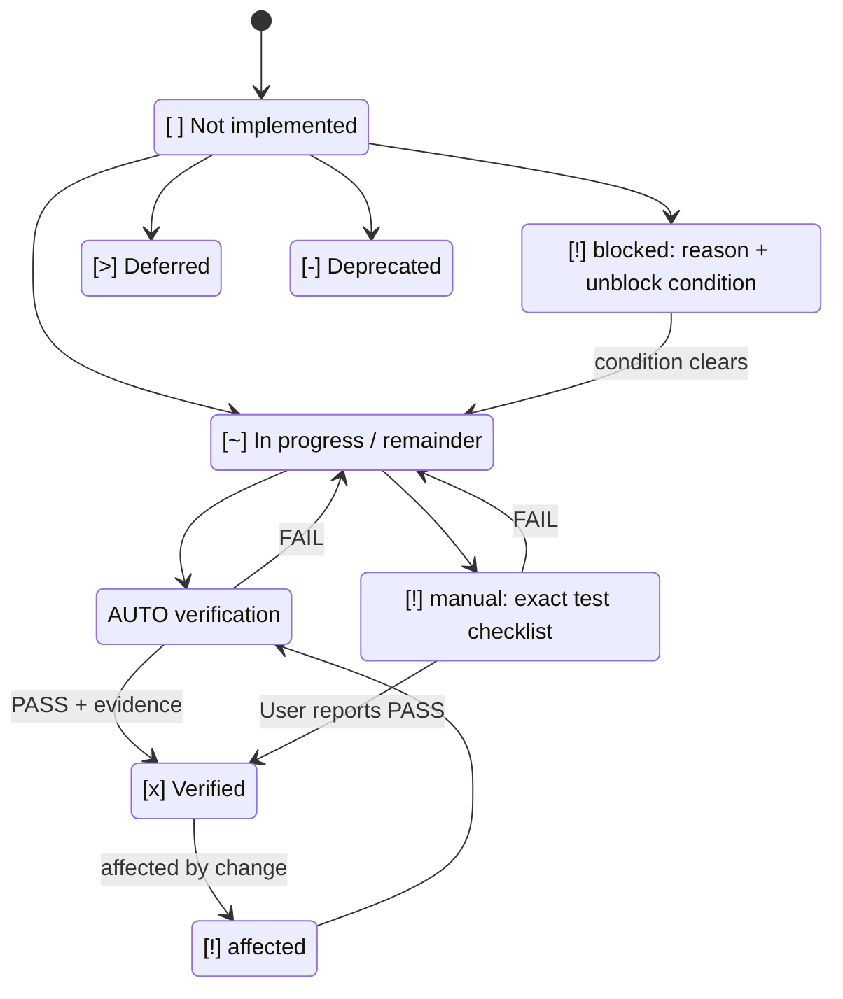
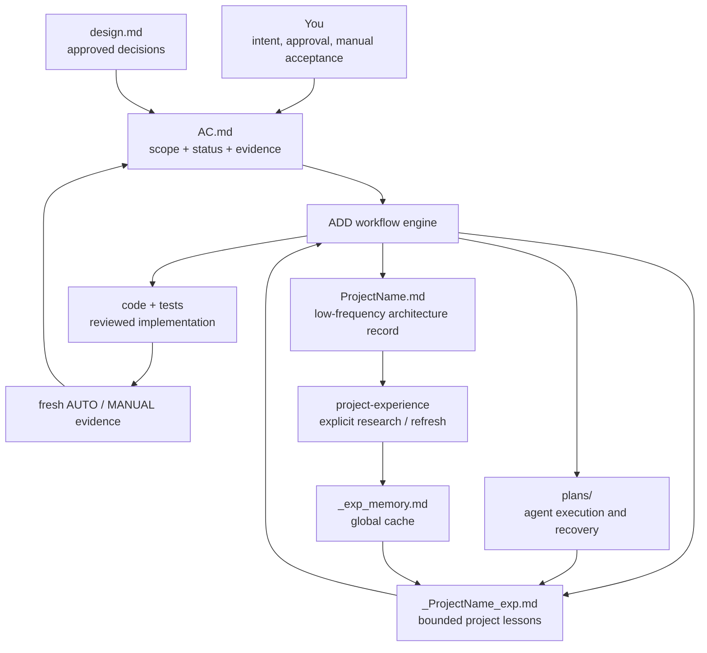

# Acceptance-Driven Development (ADD) v2.7.0

<p align="center">
  <strong>🚀 A real project-level workflow for AI coding agents</strong><br>
  From “I have an idea” to “this feature is demonstrably complete.”<br>
  Help beginners direct an agent toward genuinely usable software, while giving experienced developers an auditable engineering loop.
</p>

<p align="center">
  <strong>Acceptance contract · Impact analysis · Implementation planning · Review · Fresh evidence · Safe checkpoints</strong>
</p>

<p align="center">
  <a href="./README-zh.md">简体中文</a> ·
  <a href="#try-add-in-60-seconds">Try it in 60 seconds</a> ·
  <a href="#install-add">Install</a> ·
  <a href="#0-skills-found-in-cc-switch">CC Switch help</a>
</p>

---

## Your agent said “done.” You disagree.

AI can write code quickly. The hard part is getting a **complete, usable, and verifiable project** instead of a convincing demo that falls apart when you click the second button.

You ask for a feature. The agent writes code, the build may pass, and it confidently says **“Done.”** Then you discover that the behavior was misunderstood, a GUI path was never tested, an old feature regressed, or half the request lived only in a planning document.

> [!IMPORTANT]
> **ADD is a project-level solution, not another prompt template.** It gives the agent a persistent acceptance contract, a controlled implementation loop, evidence rules, recovery state, and an explicit definition of completion.

ADD does not make a model infallible. It makes omissions, assumptions, regressions, blocked verification, and unfinished work **visible before they are mistaken for delivery**.

### Built for people who want outcomes, not agent theater

| You are... | ADD gives you... |
|---|---|
| A beginner with a product idea | A guided path from questions and design choices to reviewable acceptance criteria and concrete test steps. |
| A developer using coding agents daily | Impact analysis, AC-mapped plans, review gates, fresh verification, and scoped local Git checkpoints. |
| Maintaining a growing project | One durable source of truth for scope, status, evidence, deferrals, and affected behavior. |
| Working across multiple projects | Living project documents and optional evidence-backed experience reuse instead of starting from zero. |

**You do not need to understand every implementation detail.** You participate where human judgment matters: clarify intent, approve the design and acceptance criteria, and perform clearly listed hands-on checks. ADD structures the rest for the agent.

---

## How ADD closes the loop



The governing rule is simple:

> **Code is output. Evidence is progress. Settled acceptance criteria are completion.**

The agent cannot honestly call a feature complete while `AC.md` still says it is unfinished, partially implemented, affected, blocked, or waiting for your test.

---

## Before ADD / After ADD

| Without ADD | With ADD |
|---|---|
| “It compiles, so it is done.” | “AC-12 passed its verification command; here is the actual result.” |
| The agent silently fills in missing intent. | Material questions are discussed; behavior changes require approval before code. |
| The plan becomes the only place tracking work. | `AC.md` remains the only user-facing acceptance authority. |
| A small fix quietly breaks another feature. | Impact analysis marks affected criteria and forces re-verification. |
| GUI work is declared complete without being used. | It remains `[!] [manual]` with exact steps until someone verifies it. |
| The agent stops after every task to announce a next step. | Approved Mode A work continues until a real gate, block, or manual handoff. |
| Repeated failure produces repeated patches. | Three failed cycles block the affected path and expose the need for guidance or redesign. |
| Each session and project starts from zero. | Bounded project experience and concise plan handoffs restore the right context without loading project history. |

---

## A complete development engine, not a checklist bolted on at the end

| Capability | What it changes in practice |
|---|---|
| 🧭 **Guided design exploration** | ADD asks one material question at a time for new or genuinely ambiguous work, compares meaningful options, and converts the approved design into ACs. |
| 🧾 **Acceptance authority** | `AC.md` owns approved scope, status, verification evidence, manual confirmation, deferral, and deprecation. Plans never own acceptance status. |
| 🔎 **Pre-code impact analysis** | Existing behavior that may regress is identified before edits and marked for fresh verification. |
| 🛠️ **Implementation assistance** | Larger work receives a persistent AC-mapped plan; small settled changes receive a lightweight six-field Execution Map. |
| 🧪 **Verification with evidence** | AUTO criteria require commands and actual results. MANUAL criteria produce a precise handoff instead of “please test it.” |
| 🔁 **Failure and recovery discipline** | Attempts, blocks, cancellation, redesign, and cross-session recovery are recorded instead of disappearing with chat context. |
| 🔒 **Safe local checkpoints** | Agent-owned changes can become narrowly scoped local commits without automatic push, PR, merge, tag, or release. |
| 🧠 **Bounded project memory** | A project capsule contributes at most 12 verified, non-obvious lessons; the global cache is read only once per new Agent session. |

### The acceptance state is visible at a glance



No green check appears merely because code was written, a plan task says `verified`, or a commit exists.

### One contract, several durable project artifacts



The boundaries matter: design explains approved choices, plans help the agent execute, and project documents preserve durable engineering facts. **Only `AC.md` tells the user what is accepted.**

---

## One workflow across different coding agents

ADD uses the portable `SKILL.md` layout and keeps project truth in ordinary Markdown files. The repository provides direct installation paths for the major agent hosts:

| Claude Code | Codex | OpenCode | Gemini CLI | Other `SKILL.md` hosts |
|:---:|:---:|:---:|:---:|:---:|
| Supported | Supported | Supported | Supported | Host-dependent |

Core ADD behavior is self-contained. External planning tools, review subagents, Obsidian, and `project-experience` are optional; their absence does not remove the acceptance loop. ADD reads the small global cache itself once per new Agent session and uses a project capsule for routine guidance.

---

## Try ADD in 60 seconds

Start a new agent session with the skill installed, then say:

```text
Build a photo browser with ADD.
```

For an existing project:

```text
Continue ImageView with ADD.
```

For a change to working software:

```text
Add bulk delete to the photo browser. Use ADD.
```

You should see the active phase, relevant ACs, impact analysis, review results, and either fresh command evidence or a concrete user-test checklist. For a new project, ADD first explores the design and presents proposed ACs incrementally so you can revise them without reviewing a wall of criteria at once.

### When ADD activates

ADD activates automatically when you create a persistent project or change behavior, code, configuration, build/deployment behavior, or public contracts in an identifiable project. For questions, explanations, read-only work, or an unrelated one-off script, it stays out of the way unless you invoke ADD once for that continuous work unit. The invocation does not carry into unrelated work.

Git inspection, a requested snapshot or commit, packaging existing content, hashes, tags, pushes, and Releases are delivery operations. They do not create ACs or enter Phase 3.5 by themselves, and a WIP snapshot does not become verified work. Only an actual source, configuration, release-structure, or observable-behavior change enters ADD; remote operations still require an explicit request. If a host discovers ADD too broadly, its Activation Gate exits before loading the document hub or project context.

---

## What you get as the project grows

### An honest acceptance table

`AC.md` is the acceptance source of truth:

| Mark | Meaning |
|---|---|
| `[ ]` | Not implemented |
| `[~]` | Approved work has a known remainder |
| `[x]` | Freshly verified passing |
| `[!] [manual]` | Needs a specific hands-on check |
| `[!] [affected]` | Previously passed, now affected by another change |
| `[!] [blocked]` | Verification unavailable; reason and unblock condition recorded |
| `[>]` | Explicitly deferred by the user |
| `[-]` | Explicitly deprecated |

### A project record that survives the session

```text
$DOC_HUB/<ProjectName>/
├── AC.md                  # sole acceptance source of truth
├── design.md              # approved design, when needed
├── plans/                 # retained Mode A execution records
├── _<ProjectName>_exp.md  # at most 12 verified project lessons
└── <ProjectName>.md       # low-frequency architecture and risk record
```

`AC.md` keeps one current-evidence row per AC; a new result replaces the old one instead of growing an EVD history. Mode A plans carry a concise `Agent Handoff`, and the project capsule points to the latest completed plan. The full project document is loaded only when durable engineering facts are needed.

### Powerful when needed, quiet when it is not

You do not need to memorize internal terms before using ADD:

- **Phase 3.5A** safely enters already approved backlog work.
- **Phase 3.5B** handles a feature, bug, refactor, or behavior change before code.
- **Mode A** uses a persistent, AC-mapped plan for approved backlog and larger batches.
- **Mode B** uses a chat-only six-field Execution Map for one or two settled ACs.
- Both require impact analysis, review, verification, and acceptance-state updates.

You approve the design and acceptance criteria, not the agent's internal task plan. After Agent-side checks pass, ADD creates narrowly scoped local Git checkpoints by default. It preserves pre-existing changes, reports `COMMIT-BLOCKED` when isolation is unsafe, honors an explicit no-commit instruction, and never pushes, opens or merges a PR, tags, or publishes by itself.

---

## Install ADD

Install ADD. For explicit cross-project research or an approved global-cache refresh, also install the recommended companion:

```text
acceptance-driven-development
project-experience
```

ADD owns acceptance, routine project-capsule use, and conditional design exploration. `project-experience` is optional and runs only for explicit cross-project research or an approved `_exp_memory.md` refresh.

### Option 1 — CC Switch

1. Select the target agent application.
2. Open **Skills → Discover Skills → Repository Management → Add Skill Repository**.
3. Enter:

   ```text
   Repository URL: https://github.com/ZeusYue/acceptance-driven-development-skill
   Branch: main
   ```

4. Return to **Discover Skills**, refresh if needed, and install `acceptance-driven-development`.
5. Optionally install the recommended `project-experience` companion.
6. Start a new agent session.

The repository already uses the discovery layout CC Switch scans recursively:

```text
skills/
├── acceptance-driven-development/SKILL.md
└── project-experience/SKILL.md
```

For detailed troubleshooting, see [CC Switch installation](./docs/CCSWITCH.md).

### 0 skills found in CC Switch

After URL and branch are correct, zero skills can still be a temporary **GitHub archive download or refresh** failure rather than a repository-layout problem.

Check in this order:

1. Repository URL is the repository root — not a file URL or `tree/...` URL.
2. Branch is exactly `main`.
3. Return to Discover Skills and refresh the scan.
4. Restart CC Switch, then refresh again.
5. If the saved record cannot be corrected, delete it and add it again.

#### Network and proxy

CC Switch discovers a repository by downloading its GitHub branch archive. If GitHub access is restricted or unstable, the UI may show zero skills without explaining the download failure.

- Open this address in a browser to verify the archive path is reachable:

  ```text
  https://github.com/ZeusYue/acceptance-driven-development-skill/archive/refs/heads/main.zip
  ```

- If it does not download, switch networks or configure the system / CC Switch network proxy according to your environment.
- After network or proxy changes, restart CC Switch and refresh Discover Skills.
- If the archive downloads but discovery still shows zero, use manual installation and report the result in an issue with your CC Switch version and screenshots.

### Windows: “Failed to create symbolic link: …”

This is a local skill-installation permission or storage-location problem, not a repository URL or branch problem.

1. **Prefer symbolic links when they work:** they keep one shared skill definition and avoid duplicate entries in the target agent.
2. In CC Switch **Settings**, check the synchronization/install method separately from the skills storage location. `~/.agents/skills` is a useful shared storage location, but changing storage alone does not grant symbolic-link permission; restart and reinstall after changing either setting.
3. To keep symbolic links, run CC Switch as Administrator or enable Windows Developer Mode, then retry.
4. **Copy is only a temporary fallback** when symbolic links cannot be used. Explicitly select the Copy synchronization method, remove or reinstall old target-agent copies first, and avoid duplicate physical copies of the same skill.

See [CC Switch installation](./docs/CCSWITCH.md) for the full recovery sequence.

### Option 2 — Manual installation

Copy the complete `skills/acceptance-driven-development/` directory, including `assets/` and `references/`, into the skill directory documented by your host. Optionally copy the complete `skills/project-experience/` companion too:

| Agent host | Typical skills directory |
|---|---|
| Claude Code | `~/.claude/skills/` |
| Codex | `~/.codex/skills/` |
| Gemini CLI | `~/.gemini/skills/` |
| OpenCode | `~/.config/opencode/skills/` |
| Hermes | `~/.hermes/skills/` |

For a GitHub Release ZIP, extract the archive first, then copy its complete `skills/acceptance-driven-development/` directory. Do not copy only `SKILL.md`; the workflow requires its shipped `assets/` and `references/`.

---

## First Run: choose a document hub

On the first ADD-activated project request, ADD asks for one stable directory shared across projects. A good answer is:

```text
~/project-docs/
```

ADD writes `~/.add-hub` and keeps project ACs, plans, templates, project capsules, and the optional global cache there. Obsidian is helpful but not required.

---

<details>
<summary><strong>📦 Release history and technical contract details</strong></summary>

The sections below preserve version-specific behavior and migration details for maintainers and existing users. New users can start with the workflow and installation guide above.

## v2.7.0: Less context, stronger continuity

v2.7.0 keeps the closed loop while removing the two largest sources of long-session growth:

- Schema 3 replaces append-only EVD history with **Current Verification Evidence**, keyed by AC ID; each AC has at most one row, a new result replaces the old one, and `[x]` requires a current `PASS`;
- a strict Activation Gate auto-runs ADD only for persistent project creation or identifiable project changes; other work needs one explicit invocation, while questions, read-only tasks, and unrelated one-off scripts stay outside;
- delivery-only Git snapshots/commits and package/hash/tag/push/Release requests create no AC and do not enter Phase 3.5; only actual project changes do, and WIP never implies verification;
- `How to Verify` keeps reusable commands or manual steps only, while long logs remain outside `AC.md` behind a stable locator;
- a failed Mode B verification returns through Phase 3.5A while retaining Mode B and the same target-specific attempt series. Pre-limit failures use `FAIL`; the limit uses `BLOCKED`; a MANUAL handoff keeps the series as `pending-manual` and a pass closes it as `completed`. A normal `3/3` block cannot resume through cancellation or rejection;
- every new Agent/session reads `_exp_memory.md` once, then each independent Mode A or Mode B work unit reads only `_<ProjectName>_exp.md` once;
- a missing project capsule is copied from the language-matching built-in template, then seeded from at most three relevant global lessons already read in the session; it stays flat, holds at most 12 difficult, non-obvious, verified lessons, and merges duplicates;
- only a successfully completed Mode A plan that was not superseded may add project lessons or advance `latest_completed_plan`. Mode B never writes lessons, and a qualifying completion advances the pointer even when no lesson changes;
- every Mode A plan starts with a concise six-field **Agent Handoff**. A new Agent scans plan frontmatter, restores the sole matching active plan, or reads the latest completed plan handoff only after its worktree, branch, and baseline match. A cancelled or rejected paused plan owns overlapping ACs until explicit restart or atomic approved supersession closes it before activating a replacement;
- routine work extracts all AC rows but fully loads only target, affected, and nonterminal criteria plus their current evidence. Templates, the full project document, old plans, and conditional references are loaded only when needed;
- detailed failure, block, cancellation, rejection, redesign, and mode-switch transitions live in a conditional recovery reference. Mode B-to-A recovery maps each unfinished target into one task without resetting attempts; manual handoff waits until independent ready work is complete; Mode A-to-B keeps a durable owner through interruption;
- one or two targets use Mode B only when settled and low-risk. Architecture, dependency behavior, concurrency, persistence, security, migrations, public contracts, and broadly shared components always use Mode A;
- `project-experience` no longer activates for ordinary coding or Mode A/Mode B execution. Explicit cross-project research degrades to bounded read-only project-document inspection when the cache is missing; approved global-cache refreshes admit completed, non-superseded-plan project lessons and exclude global-cache seeds.

Schema 2 AC documents remain readable until migration is separately approved. Migration keeps IDs, scope, current state, reusable verification, and the latest meaningful result while removing superseded EVD history.

---

## v2.6.0: Implementation that remains inspectable and resumable

v2.6.0 adds the execution layer that connects approved ACs to verified code:

- Mode A creates or safely resumes one persistent plan; completed plans are never overwritten or reopened;
- Mode B uses a six-field chat-only Execution Map that still records status, attempts, repository baseline, evidence, review, and commit outcome;
- each Mode B target keeps an independent, collision-safe attempt series in AC evidence; after lost chat context, ADD resumes from that evidence and its approach reference or returns to Phase 3.5B instead of guessing;
- tasks choose `TEST-FIRST`, `CHARACTERIZATION`, `TEST-AFTER`, or `MANUAL` instead of forcing one test style onto every project;
- independent tasks may run in parallel only with non-overlapping write scopes; cancellation or post-approval rejection drains delegates, pauses Mode A with a distinct reason, and persists Mode B recovery state without consuming a failed attempt;
- an unavailable required environment or tool becomes an evidence-backed block immediately instead of leaving an active task hanging or inventing a failed cycle; independent work continues;
- a material Mode A-to-B redesign settles delegates and old task ownership before Mode B starts; when Mode B settles, the old plan is completed or reactivated for its remaining work;
- three failed implementation/verification/review cycles block only the affected work unless a shared prerequisite blocks the batch;
- safe local commits re-check the index, active Git operations, hooks, staged content, final commit, and working tree without touching remotes;
- v2.6.0 used stable EVD and scope-decision records outside readable AC table cells; v2.7.0 supersedes the EVD history with one current-evidence row per AC.

`AC.md` remains the only acceptance-status authority. A verified plan task or local commit never marks an AC complete by itself.
Checkpoint outcomes are a commit hash, `COMMIT-BLOCKED`, or `COMMIT-SKIPPED`; unexpected post-hook changes stop further commits as `COMMIT-REVIEW-REQUIRED`.

---

## v2.5.0: Built-in ADD design exploration

v2.5.0 removes ADD's remaining Superpowers coupling:

- ADD now conditionally loads its own design-exploration reference for explicit ADD exploration, Greenfield Gate 1, and Large or genuinely ambiguous Phase 3.5B changes;
- it asks only material questions, compares meaningful alternatives, obtains one design approval, and records a **Design Decision Handoff** without leaving the ADD workflow;
- Large Phase 3.5B work presents the design and proposed AC delta for one combined approval;
- the design reference does not impose `docs/superpowers` or another methodology; it hands approved scope back to ADD's own planning and execution layer;
- external planning tools are optional; ADD's built-in Mode A plan remains mandatory, every task maps to AC IDs, and plan status never owns acceptance status;
- an approved behavior delta invalidates any edited target's stale `[x]` before code, while a resumed deferred `[>]` criterion has explicit unchanged-scope and changed-scope routes back to executable status;
- approved backlog, settled Small or Medium changes, original-behavior bugs, equivalent refactors, build/config changes, and pure cosmetics skip the design reference;
- no separate ADD brainstorming skill is installed, so Superpowers' generic `brainstorming` can coexist without name or trigger ambiguity.

ADD remains fully functional when a planning tool, a review subagent, or `project-experience` is unavailable.

---

## v2.4.2: Readable AC tables and evidence details

v2.4.2 keeps acceptance tables scannable without weakening `AC.md` authority:

- all five-column AC tables can use stable, full-width proportions in Obsidian through the optional `ac-document-tables.css` asset;
- `ID` and `Status` stay compact while criteria, verification, and expected-result cells wrap normally;
- full logs, benchmark samples, screenshot notes, and step-by-step user feedback move to **Verification Evidence Details** in the same `AC.md`;
- English, Chinese, installable, and manual-download templates now share the same schema and evidence layout;
- the release validator protects the style class, evidence section, CSS asset, and long-evidence boundary.

Existing AC documents remain valid. To opt an Obsidian AC into the layout, add `cssclasses: ac-document`, copy `ac-document-tables.css` into `.obsidian/snippets/`, and enable the snippet. Other Markdown hosts simply ignore the optional class.

---

## v2.4.1: Mode A continuation hotfix

A progress update is not a pause gate. While an approved Mode A batch still contains ready `[ ]` or `[~]` ACs, ADD continues sequentially by default and may parallelize only non-overlapping tasks. A plan task or subagent dispatch is never a reason to ask whether to continue; only explicit ADD gates and real host/tool limits may pause the batch.

---

## v2.4: AC Authority Restoration

v2.4 restores `AC.md` as the workflow engine’s non-negotiable authority:

- installable template assets seed a missing document hub instead of asking the agent to invent an AC layout;
- an **AC Contract Gate** validates the AC schema before a plan or code can begin;
- implementation plans are derived from approved ACs, include an Acceptance Mapping, and **plans never own acceptance status**;
- every manual criterion receives a structured Manual Verification Handoff with exact steps and an AC-ID reply format.

Existing localized AC documents remain supported. ADD preserves their IDs, evidence, and language; ambiguous migrations require user confirmation.

---

## v2.3.1 installation documentation hotfix

v2.3.1 does not change the ADD workflow. It corrects the Windows CC Switch recovery path:

- prefer symbolic links when they work, so the target agent sees one shared skill definition;
- use `~/.agents/skills` to address shared-storage/layout issues, but use Administrator mode or Windows Developer Mode to grant symbolic-link permission;
- if links still cannot be used, explicitly select Copy only as a temporary fallback because duplicate physical copies can produce duplicate skill entries.

---

## Migrating to v2.3

Existing AC tables and installation methods remain compatible. v2.3 makes ADD easier for agents to load without removing its workflow safeguards:

- `SKILL.md` is now a shorter operational core: entry gates, Phase 3.5, implementation modes, review, fresh verification, completion, living-project documents, and atomic cache refresh stay there;
- worked scenarios, rationalization guardrails, extended red flags, and detailed change-design guidance moved to `references/` and remain part of the skill;
- the release validator enforces the core contracts, all required reference files, and a 380-line budget.

Do not delete `_exp_memory.md` to refresh it. Ask to update the experience cache so it can be rebuilt safely.

</details>

---

## Support and contributions

- Report workflow gaps, documentation problems, or installation results through [GitHub Issues](https://github.com/ZeusYue/acceptance-driven-development-skill/issues).
- Read the [maintainer improvement guide](./docs/IMPROVEMENT-GUIDE.md) before changing workflow contracts.
- When changing a workflow contract, update its skill, template/reference, README, and `tests/validate-release.ps1` together.

Released under the [MIT License](./LICENSE). Copyright © 2026 ZeusYue.
