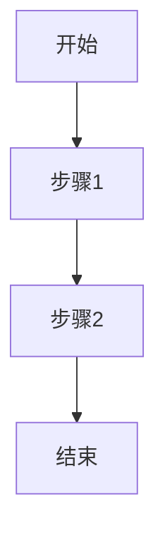

---
template: project-doc
version: 2.1
tags:
  - 项目
status: 开发中
date: {{YYYY-MM-DD}}
---

# {{项目名称}}

> **Agent 使用说明**
>
> 1. **信息来源优先级**：代码 > 配置文件 > 注释 > README > commit 记录 > 合理推测
> 2. **诚实标注**：无法从代码中确定的项，标注「⚠ 无法确定」并给出推测依据
> 3. **粒度原则**：核心模块 3-8 个，API 列主要的不列全部的，依赖只列"不一眼能看出用途"的
> 4. **领域知识**：如果项目涉及专业领域（科学计算、金融、工控等），请用 1-2 句解释关键术语，让非该领域开发者也能理解
> 5. **活文档原则**：开发中项目也要创建和更新本文档；已实现内容写事实，计划/猜测内容标注「planned」或「⚠ 无法确定」。只有代码、配置、测试或已解决事故直接支持的内容，才可进入“可复用模式”或未来经验缓存。
> 6. **完成后自审**：在末尾「Agent 自审笔记」中交代你的假设、不确定项、建议人类验证的内容
> 7. **文件命名**：输出文件应命名为 `$DOC_HUB/<ProjectName>/<ProjectName>.md`，**不要**命名为 `README.md`（会导致 Dataview 索引中所有项目显示为相同名称）
> 8. **状态维护**：`status` 使用 `开发中`、`维护中`、`已完成` 或 `归档`；项目完成时保留既有证据并更新状态，不要重写成脱离代码的总结。

---

## 📌 一句话概述

<!-- 读完 README、主入口、核心业务逻辑后，用一句话说清：这个项目做什么、给谁用 -->

{{一句话描述}}

---

## 🚀 快速上手

<!-- 从 README / Makefile / docker-compose / package.json scripts / CI 配置中提取 -->

- **构建**：
- **运行**：
- **测试**：
- **必备环境**：（Node 版本、JDK 版本、系统依赖……）

---

## 🧱 技术栈

<!-- 从依赖声明文件（package.json / go.mod / Cargo.toml / .pro / CMakeLists.txt）提取，与代码中的 import 交叉验证 -->

| 层级 | 技术 | 版本 | 用途 |
|------|------|------|------|
| 语言 | | | |
| 框架 | | | |
| 数据存储 | | | |
| 其他关键依赖 | | | |

> **注意**：如果版本号无法从依赖文件中确定（如 `^2.0`），填写范围即可，不要编造精确版本号。

---

## 📂 项目结构

<!-- 列出目录树（建议 2-3 层），标注每个目录/关键文件的职责。生成的文件用 ⚙️ 标记 -->

```
项目根目录/
├── src/                   # 主源码
│   ├── controllers/       # 请求处理
│   ├── services/          # 业务逻辑
│   ├── models/            # 数据模型
│   └── utils/             # 工具函数
├── tests/                 # 测试
├── config/                # 配置文件
├── scripts/               # 构建/部署脚本
├── Makefile        ⚙️     # 生成的文件
└── package.json           # 依赖声明
```

---

## 🧠 领域知识（如适用）

<!-- 如果项目涉及专业领域术语，用 2-3 句话解释核心概念，让新加入的开发者能看懂后续内容 -->

| 术语 | 解释 |
|------|------|
| {{术语1}} | |
| {{术语2}} | |

---

## 🏗 架构模式

<!-- 根据代码组织方式推断，必须给出「判断依据」而非仅写结论 -->

- **识别到的模式**：（分层架构 / 六边形架构 / MVC / 微服务 / DDD / 管道-过滤器 / 事件驱动 / 插件式 / 其他）
- **判断依据**：（具体看到了什么？目录划分？接口抽象方向？依赖方向？消息传递机制？）

---

## 🔀 数据流

<!-- 描述数据如何在系统中流转。Web 服务侧重请求→响应链路；数据处理应用侧重输入→处理→输出管线；事件驱动系统侧重消息路由 -->

```
[输入源] → [处理环节1] → [处理环节2] → [输出]
    │            │
    └── 文件/网络/用户操作/消息队列……
```

或文字描述：数据从哪里进入系统，经过哪些关键转换节点，最终输出到哪里。

---

## 🧩 核心模块

<!-- 列出 3-8 个最重要的模块/包/类，每个在 3-5 行内说清职责、接口、依赖 -->

### {{模块名称}}
- **路径**：`src/xxx/`
- **职责**：
- **对外接口**：（关键函数签名 / 类 / 接口）
- **依赖**：（内部模块 + 关键外部库）

---

## 🗄 数据模型

<!-- 从 ORM 模型、SQL schema、struct 定义、protobuf、GraphQL schema 中提取 -->

### 核心实体

| 实体 | 存储位置 | 关键字段 | 与其他实体的关联 |
|------|---------|----------|-----------------|
| | | | |

### 实体关系

```
[EntityA] 1 ── N [EntityB] N ── M [EntityC]
```

---

## 📡 外部接口

<!-- 根据项目类型选择性填写。不限于 REST API —— 也可能是 CLI 参数、文件格式、IPC、消息队列、GPIO 引脚…… -->

### 对外接口（Web / RPC / CLI / 文件格式 / 硬件协议）

| 类型 | 接口 | 用途 | 定义位置 |
|------|------|------|----------|
| REST GET | /api/xxx | | `routes/xxx.ts:42` |
| CLI 参数 | --input | | `main.go:30` |
| 输入文件格式 | .fit | | `reader.py:15` |
| 输出文件格式 | .xlsx | | `exporter.py:80` |

---

## 🔗 关联项目（如适用）

<!-- Agent: 如果你知道同一作者/团队的其他项目，或代码风格、技术栈高度相似的项目，列出关联点和差异。无法了解 vault 内容时标注「无法确定」-->

| 项目 | 关联点 |
|------|--------|
| [[项目名]] | 共用 xx 技术 / 同用 xx 模式 / xx 模块为该项目拆分而来 |

---

## 🔄 关键业务流程

<!-- 从核心 Service / UseCase / 管线代码中梳理 1-3 个最重要的业务流程。用 Mermaid 或步骤列表 -->

### 流程：{{流程名称}}



---

## ⚙️ 配置

<!-- 从 .env.example / config files / 启动参数 / 硬编码常量中提取 -->

- **配置文件**：
- **环境变量**：
- **命令行参数**：
- **构建时配置**：（feature flags、编译宏、build tags）

---

## 📦 关键依赖说明

<!-- 只列「不是一眼能看出用途」的重要依赖。像 express/gin/spring-boot 这种框架层的不需要解释 -->

| 依赖 | 解决什么问题 | 为什么选它（如果能从代码/注释推断） |
|------|-------------|-----------------------------------|
| | | |

---

## 🛡 边缘情况与容错设计

<!-- 从错误处理代码、回退逻辑、重试机制、数据校验中提取。这些不是 bug 而是有意为之的防御性设计 -->

1. **{{边缘情况}}**
   - 在 `{{文件路径}}` 中
   - 问题：什么情况下会触发？
   - 处理方式：代码怎么应对的？
   - 为什么这么设计：（如果能推断）

---

## 🧪 测试

<!-- 从测试目录、test config、CI 配置中分析 -->

- **测试框架**：
- **测试结构**：
- **覆盖率**：（有配置就写，没有标注「未配置」）
- **运行命令**：
- **缺失评估**：（核心逻辑是否有测试覆盖？）

---

## ⚠️ 技术债与风险点

<!-- 从 TODO/FIXME/HACK 注释、deprecated API 调用、过大的文件/函数、硬编码路径、缺失的错误处理、平台耦合中分析 -->

| 问题 | 位置 | 严重度 | 说明 |
|------|------|--------|------|
| | | 🔴🟡🟢 | |

---

## 🧠 可复用的模式与技巧

<!-- 这个项目里有没有值得其他项目借鉴的设计模式、编码技巧、工具函数？ -->

1. **{{模式/技巧名称}}**
   - 在 `{{文件路径}}` 中
   - 做了什么：
   - 为什么值得复用：
   - 适用场景：

---

## 📝 整体评价

<!-- 客观、基于代码证据的评价，不是恭维 -->

- **代码质量**：⭐⭐⭐⭐⭐ — （理由）
- **架构设计**：⭐⭐⭐⭐⭐ — （理由）
- **可维护性**：⭐⭐⭐⭐⭐ — （理由）
- **文档程度**：⭐⭐⭐⭐⭐ — （理由）
- **测试覆盖**：⭐⭐⭐⭐⭐ — （理由）
- **一句话总结**：

---

## 🤖 Agent 自审笔记

<!-- Agent: 完成文档后必须填写此段，交代你的分析过程 -->

### 信息获取情况
- **完整阅读的文件**：（列表）
- **仅扫描/未读取的重要文件**：（列表，说明原因 —— 文件太大？未找到？没有访问权限？）

### 假设与不确定性
<!-- 哪些结论是基于合理推测而非直接代码证据？ -->
1.

### 建议人类验证
<!-- 哪些内容需要项目作者确认或补充？ -->
1.
